# Performing ETL Using NiFi
## To complete this assignment, follow these steps:

Before you begin the steps of the assignment below, please be sure you have your two containers running within Docker and that they are connected to the same network titled netassignment; one container is for the NiFi server and one is for MySQL. Name the NiFi container nifi and the MySQL container mysql.

**Part 1: Writing Data to an Excel File**

For the first part of this assignment, you will use the [movies.xlsx](movies.xlsx) file.

1.1 \) Open the CLI for the NiFi container. In the container bash window, navigate inside the /opt/nifi/nifi-current folder and create two folders within it: input and output. Provide a screenshot to show that you successfully created the two folders.

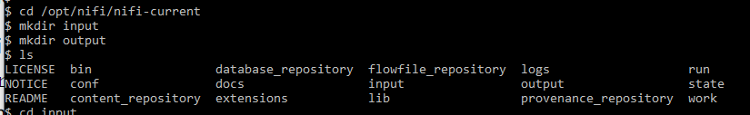

1.2\) Use the Docker copy command to copy the movies.xlsx file from your local machine in the input folder inside of your NiFi Docker container. Provide a screenshot to show that you successfully copied the movies.xlsx file in the input folder

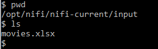

1.3\) Provide a screenshot to show that you successfully created the Assignment17 process group.  

1.4\) Provide a screenshot to show that you correctly configured the properties for the GetFile processor.  

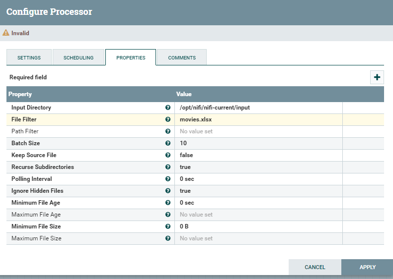

1.5\) Provide a screenshot to show that you correctly configured the properties for the ConvertExcelToCSVProcessor processor.

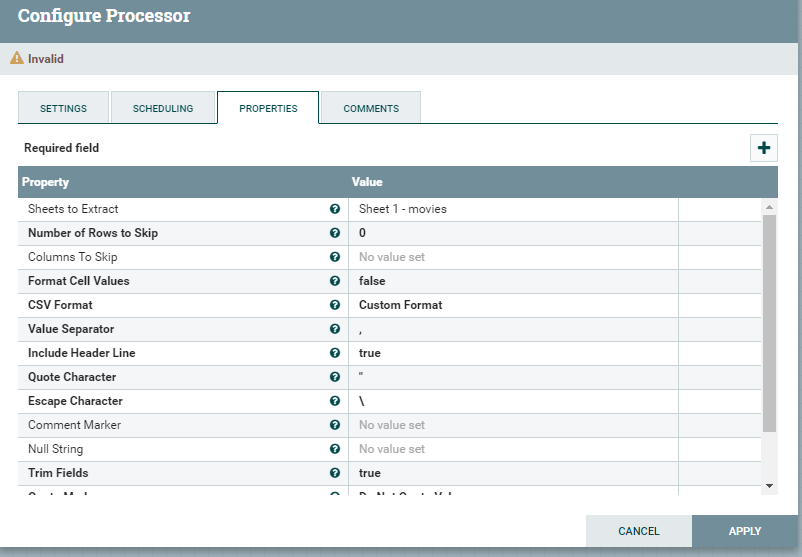

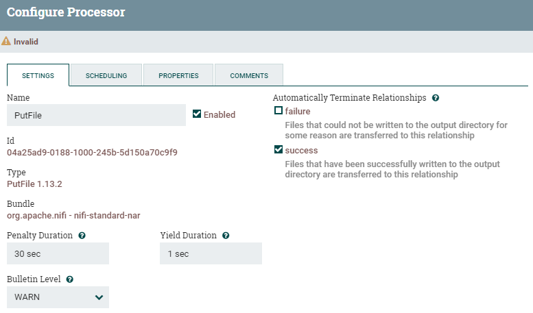

1.6\) Provide a screenshot to show that you correctly configured the properties for the PutFile processor.

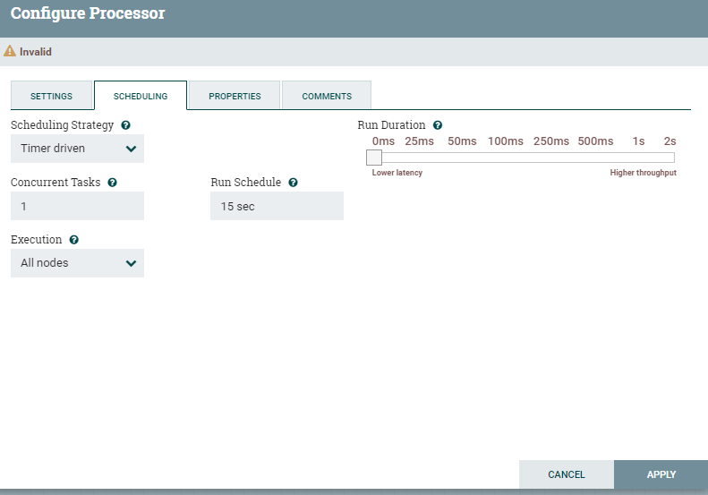

1.7\) Provide a screenshot to show that you successfully connected all the processors with the correct relationships  

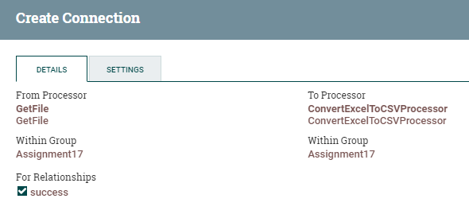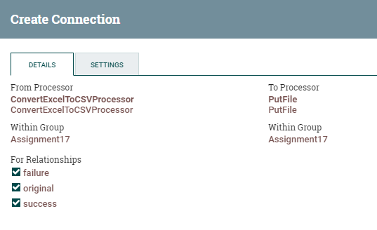

1.8\) Provide a screenshot to show that all the processors are running (as indicated by a green arrow).  

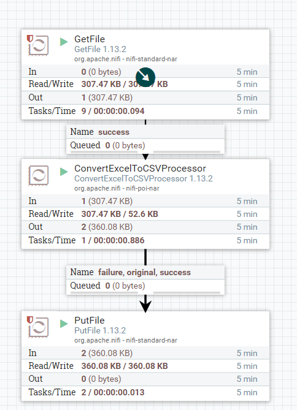

1.9\) Provide a screenshot to show that the movies_Assignment.csv file has been created.

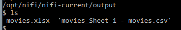

**Part 2: Writing Data to an SQL Database**

2.1\) Provide a screenshot of your MySQL Workbench to show that you have successfully initialized an empty movies table in the movielens database.  

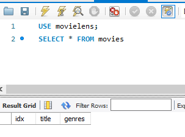

2.2\) Provide a screenshot to show that the movies.csv file is now on the NiFi server.  

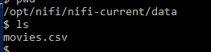

2.3\)Provide a screenshot to show that you successfully opened the NiFi UI.  

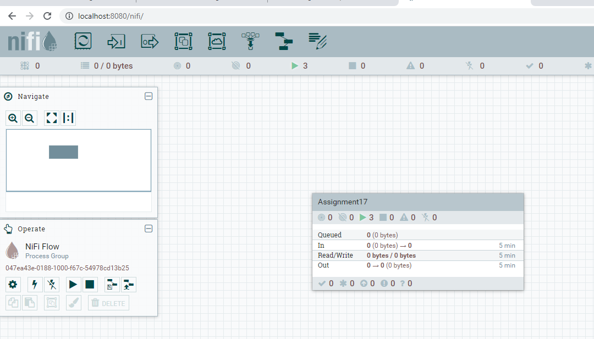

2.4\) Provide a screenshot to show that you successfully created and enabled the MySQL controller service.  

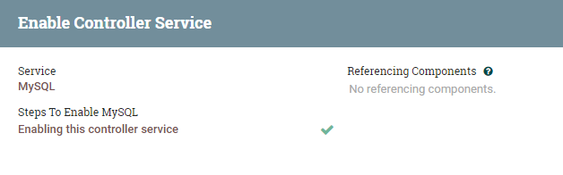

2.5\) Provide a screenshot of the controller screen to show that the three controller services (reader, writer, and MySQL) are enabled.  

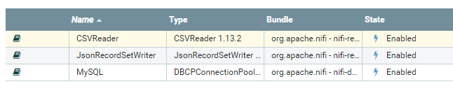

2.6\)Provide a screenshot of your complete data pipeline, including all five processors: GetFile, SplitText, ConvertRecord, ConvertJSONToSQL, and PutSQL.  

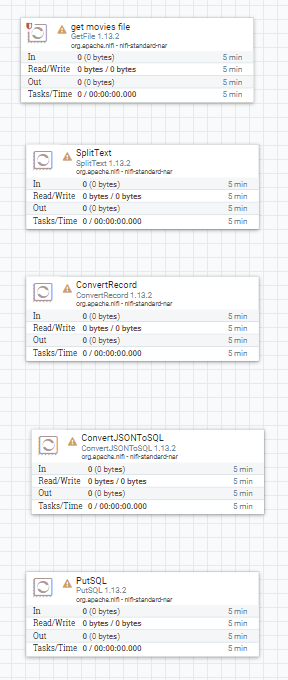

2.7\) Provide a screenshot of all five processors to show that the correct connectors have been added between the processors.  

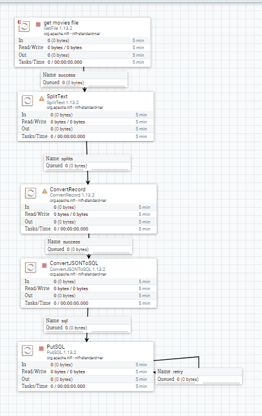

2.8\) Provide a screenshot of your NiFi browser screen to show all five processors connected and running.

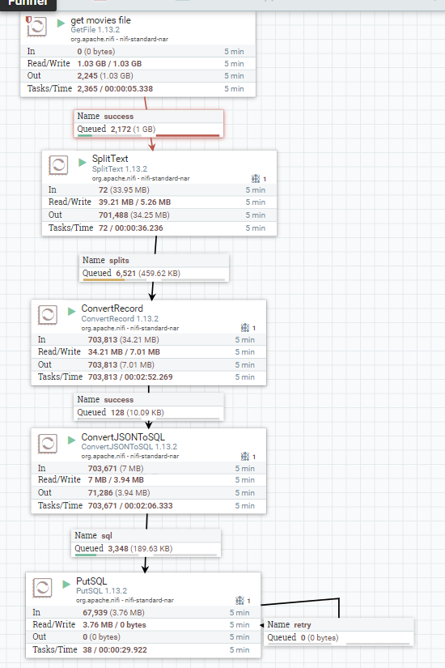

2.9\)Provide a screenshot of the result of this query to show that the movies table in the movieslens database is now saturated with data

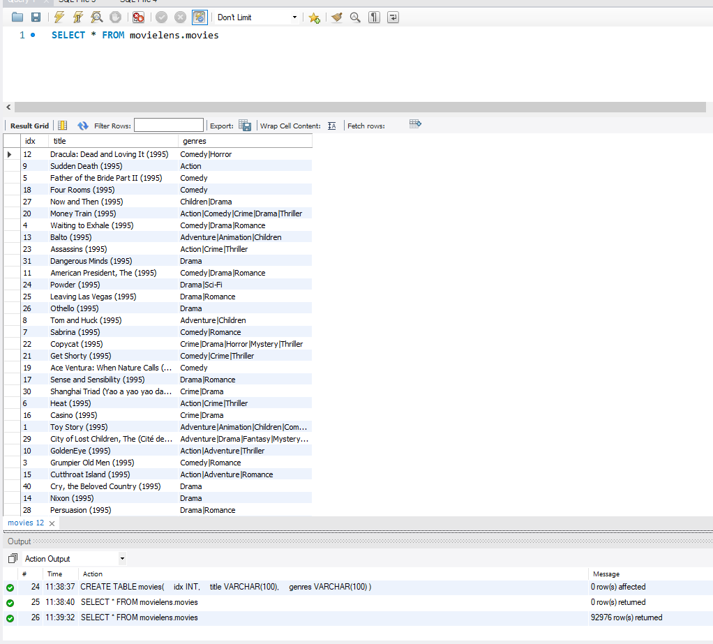
