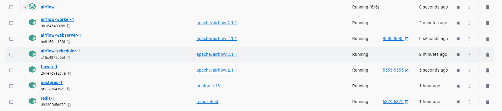

# Processing Big Data with Spark and Airflow

In this assignment, you will demonstrate your understanding of PySpark and Airflow.

The first part of this assignment focuses on PySpark. In the first part of this assignment, you will be required to create PySpark Docker containers using the Bitnami Spark Docker image Links to an external site.. Next, you will be asked to analyze data about flight delays by using SQL queries.

The second part of this assignment focuses on Airflow. You will start by initializing Airflow Docker containers. Next, you will be required to define a simple DAG that uses the PythonOperator Airflow Operator to return the value of a function. Finally, you will run your code inside the Airflow UI to ensure that your DAG works as expected.

## Part 1: PySpark

1.1\) Provide a screenshot to show that you correctly pulled the image and that the docker-compose.yaml file is present.

1.2\) Provide a screenshot of your Docker Desktop to show that you correctly pulled the containers.

1.3\) Provide a screenshot to show that you successfully copied the departuredelays.csv file to the bitnami_spark_1 container.  

1.4\) Provide a screenshot to show that you successfully opened PySpark.  

1.5\) Provide a screenshot to show that you successfully started a PySpark session.  

1.6\) Provide a screenshot to show that you successfully defined the spark PySpark session.

1.7\) Provide a screenshot to show that you successfully defined the assignment19_3_data variable.

1.8\) Provide a screenshot to show that you successfully defined the df dataframe that contains all of the entries in the departuredelays.csv file.  

1.9\) Provide a screenshot to show that you successfully created a view of the assignment19_3_table dataframe. 

1.10\) Provide a screenshot to show that you selected the correct entries from your data. Your data should display the first 15 flights from PHL to DFW that had a delay of greater than 150 minutes.  

1.11\) Provide a screenshot to show that you selected the correct entries from your data. Your data should display the first 10 flights that have a distance of less than 200 miles and the resulting table should contain all of the columns in the original dataset.  

1.12\) Provide a screenshot to show that you selected the correct entries from your data. Your data should display the first 10 flights that have a distance greater than 600 miles and the resulting table should contain all of the columns in the original dataset.  

  

## Part 2: Airflow

2.1\) Provide a screenshot of your Terminal window response to show that you correctly pulled the Airflow file.

 

2.2\) Provide a screenshot to show the changed example value ( AIRFLOW__CORE__LOAD_EXAMPLES set to false).  

2.3\) Provide a screenshot to show that the Airflow Docker containers are running.

2.4\) Provide a screenshot of your browser window to show that you have successfully logged in to Airflow.

2.5\) Provide a screenshot to show that you created the module19_assignment.py file.

2.6\) Provide a screenshot to show that you correctly imported the required libraries. 

2.7\) Provide a screenshot to show that you set up your DAG correctly, including your last name and email address.  

2.8\) Provide a screenshot to show that you defined the square() function correctly.  

2.9\) Provide a screenshot to show that you correctly defined the DAG object.  
{width="3.693781714785652in"
height="1.2204844706911635in"}

2.10\) Provide a screenshot to show that you defined the DAG Task correctly  

{width="4.5625in"
height="1.9166666666666667in"}

2.11\) Provide a screenshot of the Airflow UI to show that your DAG is configured correctly.  

2.12\) Provide a screenshot of the log to show that the DAG ran successfully. 

