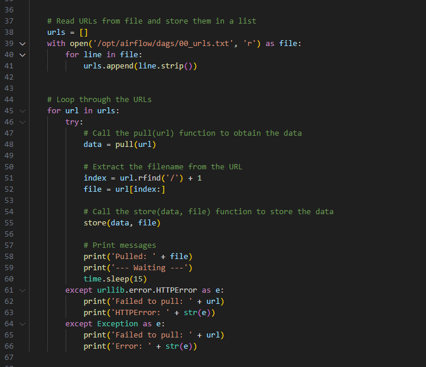

# Creating a Sensemaking Data Pipeline

## Part 1: Code Development

1.1) Provide a screenshot of the project-23 folder with the code visualization folder, airflow-docker folder, and assignment.py file within it.

1.2) Provide a screenshot to show that you have imported the DAG object, the operators, and all of the necessary task functions into the assignment.py file.       

1.3) Provide a screenshot of the pull(url)and store(data, file)helper functions defined inside of the catalog()task.  

1.4) Provide a screenshot of the entire catalog()function, including the urls list and the for loop that you just implemented.  

1.5) Provide a screenshot of the combine()method with the correct code to combine the files.  

1.6) Provide a screenshot of the completed titles()method with the correct code to open and read the HTML file generated by the combine()function.  

1.7) Provide a screenshot of the fully implemented clean()method with the correct code to remove all punctuation, numbers, and one-character words from the titles.json file.  

1.8) Provide a screenshot of the completed count_words()method with the correct code to call the store_json(data,file)helper function. 

1.9) Provide a screenshot of the DAG declaration with all six tasks, from t0 to t5, correctly defined.

### Part 2: Code Execution 

2.1) Provide a screenshot of your Docker application that shows that your Airflow Docker container has initiated.

2.2) Provide a screenshot of the task boxes to show that the DAG ran successfully.

2.3) Provide a screenshot of the words.js file with the data from the words.json file. You may not be able to fit all the data in one screenshot. If so, the first part of the file is sufficient.  

2.4) Provide a screenshot of the visualization produced with the mitcourses_graph.html file in your web browser.  

2.5) Provide a screenshot of your enhanced visualization created with the D3 library and the modified example code.

